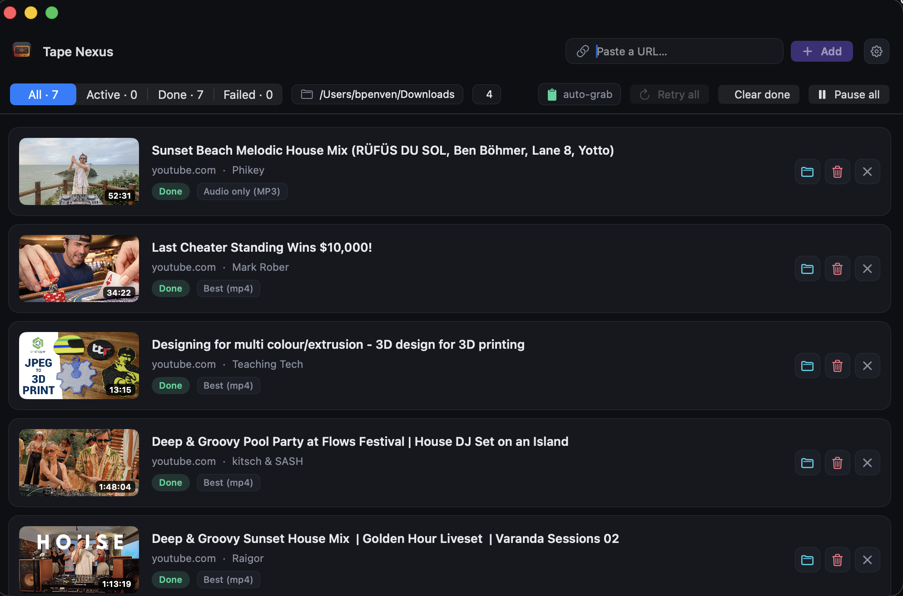

# Tape Nexus

<!-- TODO: screenshot — replace with your own -->


A native macOS app that watches your clipboard, queues any URL **yt-dlp supports**, and downloads it through `yt-dlp` — with a sleek dashboard UI, full per-item control, settings, and automatic yt-dlp updates on launch. A **Windows port** (Python + PySide6) is built alongside it from the same releases.

## What it does

Copy a link — Tape Nexus notices it, verifies it's something yt-dlp can actually download (via `--simulate`), and drops it into a queue. You start the downloads when you're ready (auto-start is off by default). Each item shows a thumbnail, title, host, chosen format, live progress, speed, ETA, and byte counts, with per-item pause / resume / stop / retry / reveal / remove / delete. It's a single-window dashboard for grabbing video and audio from the hundreds of sites yt-dlp supports, without ever touching the command line.

`yt-dlp` + `ffmpeg` are bundled, so it works out of the box. Cookies can be pulled from your browser for login-gated content, playlists can be expanded one-item-per-video, and downloads can be organized into per-host folders. A Windows build ships from the same releases as a single portable `.exe`.

## Highlights

A quick tour of what's in the box, including the recently added features:

- **Clipboard auto-grab + paste/drag** — detects copied URLs and queues only the ones yt-dlp supports; paste a block of URLs or drop a `.txt` file to queue them all at once.
- **Single-window dashboard** — dark UI, one unified list with All / Active / Done / Failed filters, live progress, speed, and ETA.
- **Per-item controls** — pause · resume · stop · retry · reveal · remove · delete file, plus a per-row format picker and time-range **clip** editor on queued items.
- **Retry all** — re-queues every failed or stopped item in one click; "Clear done" sweeps finished items out of the list.
- **Start all** *(recent)* — one click launches the whole queued backlog, honoring the concurrency limit and the start delay. Items beyond the limit stay **Queued** (not "Preparing download…") and kick off as slots free — so starting many no longer overflows into a wall of stuck spinners. The per-row ▶ Start now respects the same cap and delay.
- **Format preview** *(recent)* — "Show available formats…" runs `--list-formats` and lists every resolution / bitrate / size the link offers, so the format picker is informed instead of guessed. Picking a row applies it as a custom `-f`.
- **Per-item scheduling** *(recent)* — schedule a queued item to start at a later time, layered on top of global quiet hours. The scheduler re-checks every minute and only starts scheduled items, so auto-start being off is always respected.
- **Quiet hours** — automatically pause all downloads during a time window and resume when it ends.
- **Cookies / auth** — pull cookies from Safari, Chrome, Firefox, Edge, Brave, or Chromium for age-restricted, members-only, and login-gated content. If the chosen browser's cookie store can't be read (locked DB, schema change, Keychain denied), Tape Nexus automatically retries once without cookies so public content still downloads instead of failing silently.
- **Real failure reasons** *(recent)* — when a download fails, the actual yt-dlp error line (not just an opaque "exit code 1") is surfaced on the item and in notifications, so you can see *why* it failed.
- **Playlist expansion + per-host organization** — expand a playlist link into one item per video (capped); optionally file downloads into `<site>/<title>.<ext>`.
- **Source-friendly throttling** *(recent)* — metadata lookups run at most `max_concurrent` at a time (not all at once), and an optional **delay between starts** (up to 5 min) spaces out downloads, so adding a big playlist or batch doesn't get you IP-throttled by the source site. Bulk adds and playlist expansions resolve **top-to-bottom**, so with hundreds of items the visible top rows gather metadata first — no scrolling to watch progress. When a download is holding for the start delay, a live **"Starting in Ns"** countdown shows exactly when it'll fire.
- **Startup update check** *(recent)* — on launch the app checks GitHub for a newer Tape Nexus release and, if one's found, pops a prompt with **Skip** / **Download and install** (instead of a passive notify). On Windows, "Download and install" fetches the new `.exe`, launches it, and quits the old one so the new version takes over.
- **Subtitle language picker, SponsorBlock, metadata/subtitle embedding**.
- **Completion notifications + Dock badge** — native notification when a download finishes or fails; Dock badge shows the active count.
- **Menu-bar mode** — run as a status-bar-only app with no Dock icon.
- **Auto-update** — yt-dlp fetches its latest binary on launch; the app itself checks GitHub for a newer Tape Nexus release on startup and offers to download + install it (macOS opens Installer; Windows downloads the new `.exe` and relaunches). Manual check still available from Settings.
- **Persistence** — queue survives restarts (stored in Application Support); resolved metadata is cached so re-copied links don't re-hit the network.
- **Universal macOS build** — native on Apple Silicon and Intel; a Windows `.exe` ships from the same releases.

> Personal-use build: ad-hoc signed, **not notarized** (no paid Developer ID). Install + clear quarantine once and you're set.

## Download & install

### macOS
1. Download **`TapeNexus-1.0.10.pkg`** from the [latest release](https://github.com/jinthoa/TapeNexus/releases/latest).
2. Install it:
   ```bash
   sudo installer -pkg ~/Downloads/TapeNexus-1.0.10.pkg -target /
   ```
3. Clear the Gatekeeper quarantine flag (one time — it's ad-hoc signed, not notarized):
   ```bash
   xattr -dr com.apple.quarantine /Applications/TapeNexus.app
   ```
4. Launch from `/Applications` (right-click → **Open** the first time).

### Windows
1. Download **`TapeNexus-<ver>-win64.exe`** from the [latest release](https://github.com/jinthoa/TapeNexus/releases/latest) — a single portable executable.
2. Run it. `yt-dlp.exe` + `ffmpeg.exe` are bundled inside — no separate install.
3. SmartScreen may warn on first launch (unsigned) → **More info → Run anyway**. The first launch takes a few seconds (PyInstaller extracts its payload to a temp folder before the window opens).

The Windows `.exe` is built by GitHub Actions (`.github/workflows/build-windows.yml`) on `windows-latest` whenever a `v*` tag is pushed, so it's produced at zero cost with no Windows machine. See [`windows/README.md`](windows/README.md) to run from source or build it yourself.

## Features

- **Clipboard auto-grab** — detects copied http(s) URLs; only adds links yt-dlp actually supports (verified via `--simulate`). Unsupported links are silently skipped.
- **Sleek single-window dashboard** (dark UI) — thumbnails, title, host, format, live progress bar, speed, ETA, byte counts.
- **Unified list with filter** — All / Active / Done / Failed stay in one list; counts update live. "Clear done" removes finished items from the list. **Retry all** re-queues every failed/stopped item in one click.
- **Format preview** — on a queued item, "Show available formats…" runs yt-dlp `--list-formats` and shows every resolution / bitrate / size the link offers, so the per-item format picker is informed, not guessed. Picking a row applies it as a custom `-f`.
- **Per-item scheduling** — schedule a queued item to start at a later time (in addition to global quiet hours). The item waits in the queue until its start time, then kicks off automatically; the scheduler re-checks every minute.
- **Per-item controls** — pause · resume · stop · retry · reveal in Finder · remove · delete downloaded file. Per-row **format picker** and **clip** (time-range) editor on queued items.
- **Toolbar** — Clear done (finished items), Pause all, Retry all, paste-a-URL field. Paste a whole block of URLs (or drop a `.txt` file / drag links onto the window) to queue them all at once.
- **Cookies / auth** — pull cookies from Safari, Chrome, Firefox, Edge, Brave, or Chromium so age-restricted, members-only, and login-gated content downloads.
- **Playlist expansion** — optionally expand a playlist link into one queue item per video (capped).
- **Throttled metadata + download delay** — metadata (`--simulate`) probes run at most `maxConcurrent` at a time, so expanding a large playlist or batch-pasting URLs doesn't fire dozens of requests at the source site at once (which gets you rate-limited / 429'd). Bulk adds and playlist expansions resolve **top-to-bottom** (visible top rows first), so hundreds of items don't force you to scroll to watch progress. An optional **delay between starts** (0–300s, default off) further spaces out downloads; **Start all** and the per-row ▶ Start now both honor the concurrency cap and this delay. Items waiting out the delay show a live **"Starting in Ns"** countdown so you know they're queued-to-fire, not stuck.
- **Resilient cookies + real error messages** — if `--cookies-from-browser` fails at extraction time (the browser's cookie store is locked or unreadable on that machine), Tape Nexus falls back to a single cookieless retry so public content still downloads. And when a download fails, the actual yt-dlp `ERROR:` line is shown on the item instead of a generic exit-code message.
- **Per-host organization** — optionally file downloads into `<site>/<title>.<ext>` (e.g. `YouTube/…`) instead of a flat folder.
- **Subtitle language picker** — choose which subtitle languages to embed.
- **Completion notifications + Dock badge** — native macOS notification when a download finishes or fails; Dock badge shows the active count.
- **Menu-bar mode** — run Tape Nexus as a status-bar-only app (no Dock icon); close the window to background it, use the status icon to bring it back.
- **Quiet hours** — automatically pause all downloads during a time window and resume when it ends. Per-item scheduling (above) layers on top for individual items.
- **Settings sheet** (`⌘,`) — destination folder, default format (Best / 1080p / 720p / Audio m4a / **Audio MP3** / Custom `-f`), concurrent downloads (1–4), clipboard poll interval, SponsorBlock, embed metadata, embed subtitles, plus all of the above.
- **Auto-start on detection** — optional (default **off**). When off, detected URLs queue up and wait for you to hit ▶ Start now; nothing starts on its own.
- **yt-dlp auto-update on launch** — fetches the latest macOS binary from GitHub and atomically swaps it. Can be disabled; manual "Check now" in Settings.
- **Persistence** — queue + history survive restarts (stored in `~/Library/Application Support/TapeNexus/`). Resolved metadata is cached, so re-copied links don't re-hit the network with `--simulate`.
- **App self-update** — on launch the app checks GitHub for a newer Tape Nexus release and pops a **Skip** / **Download and install** prompt (macOS downloads the `.pkg` and opens Installer; Windows downloads the new `.exe`, launches it, and quits the old one). A manual "Check now" is also in Settings.
- **Universal build** — runs natively on Apple Silicon **and** Intel (arm64 + x86_64 app binary, plus universal `ffmpeg`/`ffprobe`).
- **PKG installer** — `build.sh` produces a `.pkg` that installs into `/Applications`; universal `ffmpeg` + `ffprobe` are bundled.

## Build & package

```bash
./build.sh
```

Produces:
- `build/TapeNexus.app`
- `build/TapeNexus-<version>.pkg`

Requirements: Xcode command-line tools (`swiftc`, `xcodebuild`, `pkgbuild`, `productbuild`, `codesign`) and `curl`. The script downloads the universal `yt-dlp_macos` binary and builds universal `ffmpeg`/`ffprobe` (arm64 slice from martin-riedl.de + x86_64 slice from evermeet.cx, merged with `lipo`) automatically.

To install a pkg you built yourself: `sudo installer -pkg build/TapeNexus-<version>.pkg -target /`, then `xattr -dr com.apple.quarantine /Applications/TapeNexus.app`.

## How it works

| Component | Job |
|---|---|
| `ClipboardMonitor` | Polls `NSPasteboard` every ~1.2s; extracts URLs; fast host pre-filter. |
| `SupportedURLs` | Curated yt-dlp host list (YouTube, Vimeo, Twitch, X, TikTok, SoundCloud, …) for the cheap pre-filter. |
| `YTDLPController` | Resolves the binary, runs `--simulate` to verify + fetch metadata, spawns downloads, parses JSON progress (`--progress-template`), sends process-tree signals for pause/resume/stop. |
| `DownloadManager` | Enforces concurrency; implements pause (SIGSTOP tree) / resume (SIGCONT) / stop (SIGTERM→SIGKILL) / retry / clear / delete. |
| `Updater` | Checks GitHub releases, downloads `yt-dlp_macos`, atomically swaps the Application Support copy. |
| `AppUpdater` | Checks GitHub for a newer Tape Nexus `.pkg`; downloads + opens Installer for the app itself (launch check is notify-only). |
| `Notifier` | Posts macOS user notifications on download completion/failure. |
| `MenuBarController` | Owns the menu-bar status item for menu-bar mode. |
| `SettingsStore` | JSON persistence under Application Support. |

Pause/resume use real POSIX process signals (`SIGSTOP`/`SIGCONT`) on the yt-dlp process tree, so they genuinely halt and resume I/O.

## Project layout

```
Sources/TapeNexus/
  App.swift                 AppKit bootstrap + window + main menu (@main)
  AppState.swift            central @MainActor ObservableObject model
  Models.swift              DownloadItem, AppSettings, statuses
  SupportedURLs.swift       clipboard URL pre-filter
  ClipboardMonitor.swift    pasteboard polling
  YTDLP.swift               yt-dlp wrapper (version/simulate/download/signals)
  DownloadManager.swift     lifecycle + concurrency + controls
  Updater.swift             yt-dlp GitHub release auto-update
  AppUpdater.swift          app GitHub release self-update (.pkg → Installer)
  Notifier.swift            macOS user notifications
  MenuBarController.swift   menu-bar status item
  SettingsStore.swift       JSON persistence
  Views/                    ContentView, QueueView, SettingsView, Theme
  Resources/Info.plist
  Resources/bin/yt-dlp      (universal, downloaded by build.sh)
  Resources/bin/ffmpeg      (universal, lipo'd by build.sh)
  Resources/bin/ffprobe     (universal, lipo'd by build.sh)
build.sh                    compile (arm64 + x86_64) → lipo → bundle → sign → .pkg
```

## Notes / limitations (v1)

- Not notarized → requires the one-time `xattr` quarantine clear (no paid Developer ID).